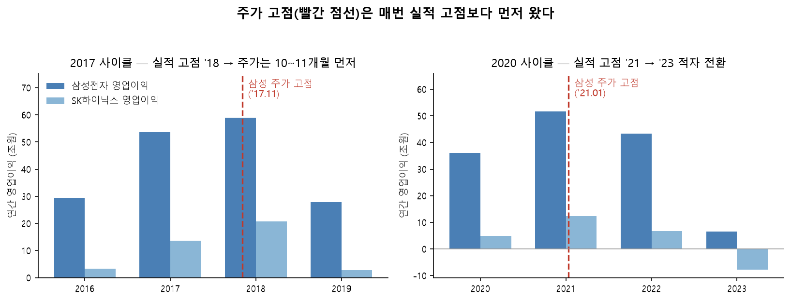

# 닭의 목을 비틀어도 새벽은 온다

### 2026년 8월

작성 2026-08-07 · 시세 기준 2026-08-06 종가

> **고지**
> · 개인의 판단 기록이며 **투자 자문이 아님**, 특정 종목의 매수·매도를 권유하지 않음
> · 모든 수치는 기준일 점추정이며 일변동함, 2026년 실적은 상반기만 확정이고 하반기는 가정임
> · 이 글의 논증은 **무엇을 얼마나 오래 들지를 정당화할 뿐 얼마에 살지를 정당화하지 않음**
> · 마지막에서 두 번째 장에 **틀렸다고 인정할 조건**을 적어둠, 그 조건이 이 글을 신앙에서 논증으로 되돌림

---

## 1. 먼저 무슨 일이 벌어졌는지

1. 7월 28일 코스피가 하루에 10.84% 빠지며 서킷브레이커가 걸렸고, 방아쇠는 중국 CXMT의 상하이 상장이었음.
2. 다음 날 SK하이닉스가 2분기 영업이익 60.5조를 냈는데 컨센서스 64조를 하회했고, 그날 9.61% 빠졌으며 장중 한때 20%까지 밀렸음.
3. 7월 31일에는 하루 17.91% 오르는 역사적 폭등이 나왔고, 8월 6일에는 매도 사이드카와 함께 다시 밀렸음.
4. 8월 6일 종가로 삼성전자 230,500원, SK하이닉스 1,495,000원이며, 하이닉스는 7월 한 달에만 41.5% 빠졌음.
5. 증권사들은 목표주가를 줄줄이 내렸는데 미래에셋은 삼성을 55만에서 37만으로, 하이닉스를 420만에서 280만으로 각각 33% 낮췄고 신한과 삼성증권도 비슷했음.
6. 반대로 한국투자증권 한 곳만 목표주가를 올렸음.
7. 여기까지가 사실이고 여기서부터는 해석임.

---

## 2. 이 그림은 내가 아는 그림임

8. 지금 화면에 떠 있는 건 내가 처음 보는 그림이 아니고, 솔직히 **빼도 박도 못하게 사이클 그림**임.
9. 사이클의 문법은 두 번 다 똑같았음. **역대급 실적이 나오는 해에 주가가 먼저 꺾이고, 한참 뒤에 실적이 따라서 박살남.**

### 2017 사이클

10. 2017년의 신규 수요는 클라우드와 데이터센터였고, 이건 테마가 아니라 진짜 구조적 신규 수요였음.
11. 삼성 영업이익은 2016년 29.2조에서 2018년 58.9조로 당시 사상 최대를 찍었고, 하이닉스는 3.3조에서 20.8조로 뛰며 영업이익률 52%를 기록했음.
12. 그런데 **삼성전자 주가는 2017년 11월 2일에 이미 고점을 찍었음** (분할 환산 57,520원). 사상 최대 실적을 발표하기 10~11개월 **전**이었음.
13. 하이닉스 고점은 2018년 5월 25일 97,700원으로, 분기 실적 고점(2018년 3분기)보다 4개월 앞섰음.
14. 그리고 2019년, 시장 말대로 실적이 박살났음. 삼성은 27.8조로 반토막(-52.8%), 하이닉스는 2.7조로 87% 증발했고, D램 가격은 한 해에만 50% 넘게 빠졌음.
15. 무너진 이유는 하나가 아니었음. 하이퍼스케일러가 과잉 발주해놓고 재고 소화로 돌아섰고, 2018년 가격 급등을 보고 결정한 증설이 뒤늦게 가동됐으며, 스마트폰 OEM은 메모리가 비싸지자 탑재량에 상한을 걸었고, 암호화폐 폭락과 미중 무역분쟁이 겹쳤음.

### 2020~2021 쇼티지

16. 2020년의 수요는 코로나 비대면 특수였고, 여기에 인력·물류·장비 인도 차질이라는 공급 충격이 겹치며 쇼티지가 왔음.
17. 삼성 영업이익은 36.0조에서 2021년 51.6조로, 하이닉스는 5.0조에서 12.4조로 뛰었음.
18. 그런데 **삼성 주가 고점은 2021년 1월 11일 96,800원**으로 실적 고점 연도의 첫 주였고, 하이닉스는 3월 2일 150,500원이었음.
19. 고점 당일 증권가는 낙관 일색이어서 한국투자증권 목표주가 12만원, KB증권 11만원 같은 상향이 줄을 이었음.
20. 그리고 **2022년 4월 주가가 7만원을 깨고 내려갔는데도 증권사 평균 목표주가는 여전히 10만원대에 머물러 있었음.**
21. 2023년 삼성 영업이익은 6.6조로 84.9% 무너졌고 반도체 부문만 약 15조 적자였으며, 하이닉스는 영업손실 7.7조에 순손실 9.1조로 완전히 적자 전환했음.
22. DDR4 8Gb 고정거래가는 2021년 7월 $4.10에서 2023년 5월 $1.40까지 **23개월 연속** 빠졌음.

### 두 바닥은 성격이 달랐음

23. 그런데 두 다운사이클의 **바닥은 전혀 달랐고**, 이 차이가 뒤에서 중요해짐.

| | 2019 바닥 | 2023 바닥 |
|---|---|---|
| 원인 | 재고 소화 **단독** | 재고 소화 **+ 최종 수요 역성장** |
| 최종 수요 | 클라우드는 계속 성장 | PC -16%, 스마트폰 -4% |
| 삼성 영업이익 | 27.8조, **흑자 유지** | 6.6조, DS는 **15조 적자** |
| 하이닉스 영업이익 | 2.7조, **흑자 유지** | **-7.7조 적자** |
| 고점 회복 | 2년 2개월 | 4년 9개월 |

24. 같은 다운사이클인데 한쪽은 흑자로 버텼고 한쪽은 적자로 무너졌으며, 갈린 지점은 **재고를 다 소화하고 났을 때 돌아올 수요가 남아 있었느냐** 하나였음.
25. 어쨌든 두 번 다 **주가는 실적을 기다려주지 않았고, 매번 시장이 먼저 맞았음.**
26. 그래서 "사상 최대 실적인데 왜 빠지냐"고 묻는 건 사이클을 두 번 겪은 사람이 할 질문이 아님. 그건 사이클의 예외가 아니라 사이클의 **정의**임.

---

## 3. 그래서 시장이 파는 게 이상하지 않음

27. 이 부분을 먼저 인정해야 함. 방향은 맞더라도 특정 시점의 주가는 예측 불가이고 변동성의 본질인데 이것을 이해 못하고 반도체 좋은데 주가는 왜 이래? 하는 것
28. 하이닉스 2분기가 컨센서스를 하회했고, 이건 "고점을 이미 지났다"는 해석에 실탄을 줬음.
29. 3분기 D램 계약가 상승률이 2분기 +58~63%에서 +13~18%로 급격히 둔화됐는데, 성장의 **크기**가 아니라 **속도**가 꺾이는 자리가 정확히 사이클 주식이 고점을 찍는 자리임.
30. CXMT가 상장에 성공하며 증설 자금을 확보했고, 이건 2027~28년 공급 곡선을 실제로 바꿀 수 있음.
31. 세트 수요는 나빠서 노트북 출하가 올해 13.5% 감소 전망임.
32. 그리고 무엇보다, **2019년에도 2023년에도 강세론자들은 지금 나와 똑같은 말을 했음.**
33. 이 다섯 가지를 다 인정하고도 다르게 볼 이유가 있어야 이 글이 성립하고, 없으면 논증이 아니라 물타기 변명임.
34. 전에 스스로에게 한 말이 있음. **노이즈를 견디려면 확신이 아니라 거의 종교적 수준의 신념이 필요한데, 투자에서 종교는 위험함.**
35. 그러니 아래부터는 신념이 아니라 반박 가능한 것만 쓰려고 함.

---

## 4. 그런데 채워야 할 독의 크기가 다름

### 교체 수요는 사이클을 만들지 않음

36. **반도체가 더도 덜도 말고 하루 세끼만 먹으면 되는 식품류였다면 애초에 사이클은 없었을 것임.**
37. 교체 수요는 사이클을 만들지 않음. 냉장고든 자동차든 수명이 다하면 바꾸고, 그 수요는 인구에 고르게 깔리므로 **잔잔한 파도일 뿐임.**
38. 빅 사이클은 언제나 **어떤 중대한 필요에 의한 인프라 투자**에서 나왔음.
39. 인프라는 성격상 몰아서 짓고 다 짓고 나면 안 지으며, 그 낙차가 사이클임.
40. 그런데 불편한 사실이 하나 있음. **2017년 클라우드도 인프라 투자였음.**
41. 그러니 "이번은 교체 수요가 아니라 인프라다"라는 말로는 2017년과 구별이 안 되고, 여기까지는 지금이 그때와 똑같음.

### 다른 건 독의 크기임

42. 구별되는 지점은 인프라냐 아니냐가 아니라 **채워야 할 독의 크기**임.
43. 클라우드는 **독의 크기가 정해져 있었고, 심지어 대충 계산이 됐음.**
44. 대략 **스마트폰을 쓰는 사람 수, 1인당 데이터 대역폭, 1인당 다루는 데이터의 크기 정도를 변수로 하는 함수였을 것임.**
45. 세 항이 전부 유한함. 사람은 80억이고 하루는 24시간이니, **클라우드의 최종 소비자는 사람의 눈과 시간이었고 그게 독의 뚜껑이었음.**
46. 그럼 지금 AI의 독은 얼마나 찼는가. **사람 기준으로만 세어도 아직 바닥임.**
47. AI가 대단하다는 말은 넘치지만 **침투율은 아직 매우 낮음.** 한번 써본 사람은 많아도 일과에 상시로 쓰는 사람은 소수이고, 기업 업무 프로세스에 실제로 박혀 들어간 비율은 그보다 더 낮음.
48. 스마트폰을 생각해보면 됨. 처음엔 트렌디한 젊은이들의 장난감이었지만 **끝에는 전 인류가 들고 다니게 됐음.**
49. 그러니 물어보면 됨. **AI의 파급력이 스마트폰보다 클까 작을까.** 작다고 답할 사람은 없을 것이고, 그 답이 맞다면 사람 몫의 독만으로도 한참 남은 것임.
50. 그런데 진짜 차이는 그다음임. **연산을 소비하는 주체가 사람에서 풀려남.**
51. 지금까지 인류의 모든 도구는 **업그레이드**였음. 괭이든 엑셀이든 한 사람이 시간당 해내는 양을 늘렸을 뿐, 일하는 주체는 언제나 그 사람이었음.
52. 에이전트는 다름. 업그레이드가 아니라 **유닛을 뽑는 것**임. 마린키우기에서 공방 업그레이드만 돌리다가 처음으로 마린이 한 기 더 나온 순간이고, **자동화를 다시 자동화하는 것**임.
53. 에이전트가 에이전트를 호출하고, 모델이 모델을 학습시키고, 추론이 추론을 검증하며, 사람이 자는 동안에도 돌아감.
54. 이게 얼마나 큰 얘기냐면, 경제학은 **인구가 많은 나라가 큰 경제를 갖는다**는 전제 위에 서 있음. 성장의 근본 투입이 노동이고 노동은 인구에 묶여 있기 때문임.
55. **일하는 주체를 인구 밖에서 찍어낼 수 있게 되면 그 전제가 흔들리고**, 이건 반도체 사이클 논쟁보다 훨씬 큰 담론임.
56. **사람의 24시간이라는 뚜껑에서 풀려나는 것**, 이것이 이번이 구조적으로 다른 이유임.
57. 그리고 이건 뒷장에서 다룰 부트로더 논증을 투자 언어로 옮긴 것임. **인간 지능이 AI의 상한이 아니라면, 인간의 수도 수요의 상한이 아님.**

### 전기가 무엇을 풀었는지

58. 층위를 가늠할 비유가 하나 있음. **전기 이전에 인류가 쓴 에너지의 대부분은 생체에너지였음.**
59. 사람 한 명의 지속 출력은 약 75W이고 말 한 마리가 746W이니, 그 시절 한 사람이 동원할 수 있는 동력은 자기 몸과 가축 몇 마리가 전부였음.
60. 그런데 진짜 제약은 크기가 아니라 **이동 불가능성**이었음.
61. 물레방아는 에너지를 옮길 수 없으니 **공장이 폭포 옆으로 가야 했고**, 증기기관도 중앙 동력축에 벨트로 물려야 해서 공장 레이아웃 전체가 축에 종속됐음.
62. **지능도 지금까지 정확히 같은 제약을 받았음.** 한 사람 머릿속의 지능은 복사가 안 되고, 말과 글이라는 극도로 좁은 대역폭으로만 전달되며, 그 사람이 죽으면 사라짐.
63. 인공지능은 그 셋을 전부 품. 가중치는 복사되고, 학습은 병렬로 일어나며, 죽지 않음.
64. **생체지능에서 인공지능으로 넘어간다는 말의 실질이 이것이고**, 전기가 에너지를 옮길 수 있게 만든 것과 같은 층위의 사건임.

### 돈 내는 쪽도 바뀌었음

65. 독의 크기만큼 중요한 게 하나 더 있는데, **누가 돈을 내느냐**임.
66. 2017년과 2020년에 메모리 값을 최종적으로 낸 건 마진이 얇은 세트업체였고, 이들은 메모리가 비싸지면 **탑재량을 줄여서 대응**했음. 2018년 스마트폰 OEM들이 플래그십 D램 용량에 상한을 건 게 그거임.
67. 지금 돈을 내는 건 하이퍼스케일러이고, 빅테크 4사의 2026년 캐팩스 합계는 약 $725B로 전년비 77% 늘었으며 알파벳은 2분기에 오히려 가이던스를 상향했음.
68. 이들은 안 사면 경쟁에서 밀리는 위치라 **가격 비탄력적**이고, 애초에 메모리 값은 이들 캐팩스의 일부일 뿐임.
69. 그리고 구조 변화가 하나 있음. 삼성이 7월 30일 컨콜에서 **생산능력의 60~70%를 장기공급계약으로 할당했고 데이터센터 고객 5곳과 체결을 마쳤다**고 밝혔음.
70. **구매자가 가격이 아니라 물량 확보를 걱정하고 있다는 뜻이고**, 사이클 상단에서 구매자가 다년 계약으로 물량을 묶는 행동은 재고 소화를 준비하는 행동과 정반대임.

### 여기서 스스로 반박함

71. 이 논증은 내 편만 들어주지 않으므로 반대쪽도 적어야 함.
72. **첫째, 전기 비유는 시점에 대해서는 정반대를 말함.** 전기가 보급되고 공장 생산성이 실제로 도약하기까지 약 40년이 걸렸고, 공장이 중앙 동력축을 버리고 기계마다 모터를 다는 방식으로 레이아웃을 다시 짜기 전까지 생산성 통계에는 아무것도 안 나왔음 (David, '90).
73. 증기는 와트 이후 약 100년 뒤에 성장 기여가 정점이었음 (Crafts, '04).
74. 즉 **전기급이라는 말은 크기에 대한 주장이지 시점에 대한 주장이 아니고**, 범용기술의 역사는 오히려 "맞았는데 20년 일찍 맞았다"의 역사임.
75. **둘째, 독이 크다는 게 사이클이 없다는 뜻은 아님.** 2019년에 클라우드 독이 다 찼던 게 아니고 클라우드 매출은 그때도 지금도 계속 늘고 있음.
76. **2019년은 독이 차서 온 게 아니라 물 붓는 속도를 잘못 잡아서 온 것이며**, 독이 아무리 커도 과속하면 소화 구간은 옴.
77. 데이터센터가 사는 건 토큰이 아니라 GPU와 HBM이고 그건 명백히 자산으로 쌓이므로, **AI도 재고 사이클 안에 있고 이번에도 조정은 옴.**
78. **셋째, 이게 제일 아픈데, 능력이 빨리 좋아지는 게 곧 연산 수요 증가를 뜻하지 않음.**
79. 내 항등식은 이럼. **연산 수요 = 토큰 소비량 × 토큰당 FLOPs ÷ 알고리즘 효율 개선률.**
80. 1년 만에 파워포인트를 딸깍으로 만든 힘의 상당 부분이 알고리즘 효율 개선인데, 그건 **분모**임. 같은 일을 더 적은 연산으로 한다는 뜻이므로 분모가 분자를 이기면 내 명제는 틀림.
81. 지금까지는 분자가 이겼음. 블렌디드 추론 단가가 1년 만에 67% 떨어졌는데 총지출은 오히려 늘었고, 싸지니까 더 쓰는 제번스 역설이 작동했음.

### 정리

82. 세 사이클을 나란히 놓으면 이럼.

| | 2017 클라우드 | 2020 코로나 | 2026 AI |
|---|---|---|---|
| **하드웨어 재고화** | 쌓임 | 쌓임 | **똑같이 쌓임** |
| 독의 뚜껑 | 사람의 눈과 시간 | 가구당 1대 | **안 보임** |
| 최종 지불자 | 세트업체 | 소비자 | **하이퍼스케일러** |
| 가격 탄력성 | 높음 | 높음 | **낮음** |
| 계약 구조 | 스팟 중심 | 스팟 중심 | **LTA 60~70%** |
| 조정 경로 | 재고 소화 | 재고 소화 + 수요 붕괴 | **재고 소화 (예상)** |
| 바닥의 결과 | 흑자 유지 | **적자 전환** | ? |

83. 첫 줄이 "똑같이 쌓임"인 게 핵심임. **나는 이번에 재고 소화가 면제된다고 주장하는 게 아님.**
84. 내 주장은 오직 마지막 줄에 대한 것임. **조정이 와도 2023년형이 아니라 2019년형, 즉 흑자 구간에서 멈추고 재개될 것.**
85. 훨씬 약한 주장이지만 이건 방어할 수 있고, 다행히 §6의 스트레스 테스트에서 숫자로 검증 가능함.

---

## 5. 그렇다면 시스코를 정확히 봐야 함

86. 이번 국면의 비교 대상은 2017년도 2020년도 아니고 최소한 **닷컴**이어야 한다고 봄.
87. 그런데 이 비교는 강세 논거가 아니라 **양날의 칼**이고, 얼버무리면 안 됨.
88. 닷컴의 서사는 100% 실현됐음. 인터넷은 세상을 바꿨고 시스코는 그 인프라 층의 진짜 승자였음.
89. 시스코는 2000년 3월 27일 $80.06으로 마이크로소프트를 제치고 **세계 시총 1위**(약 $555B)에 올랐음.
90. **그때 시스코의 선행 PER은 약 131배, 후행 PER은 200배를 넘었음.**
91. 131배라는 건 시장이 **엄청난 성장을 이미 지불했다**는 뜻이고, 실제로 챔버스 CEO는 "연 30~50% 성장, 2004년 매출 500억 달러"를 약속했음.
92. 결과는 이럼. **FY2000에서 FY2004까지 매출 연평균 성장률 3.9%, 2004년 매출은 220억 달러로 약속의 44%였음.**
93. FY2001에는 초과재고 20.6억 달러를 상각하며 적자를 냈음.
94. 여기가 핵심임. **시스코가 그 뒤로 계속 흑자였다는 사실은 강세론의 방어가 되지 않음.**
95. 200배가 넘는 배수가 몇 년간 유지됐다는 건 시장이 그만큼의 기대를 지불했다는 뜻이고, **그 기대를 끝내 못 채웠다는 것 자체가 버블을 붕괴시킨 시장이 옳았다는 증거임.**
96. 기준은 이익이 늘었느냐가 아니라 **매겨진 기대만큼 늘었느냐**이고, 시스코는 그 기준에서 명확히 실패했음.
97. 25년의 산수가 이걸 그대로 보여줌.

| | 2000-03-27 고점 | 2025-12-10 회복 | 배율 |
|---|---|---|---|
| 주가 | $80.06 | $80.25 | **1.0배** |
| 순이익 | $2.67B | $10.5B | 3.9배 |
| EPS | $0.36 | $2.61 | 7.3배 |
| 후행 PER | 200~222배 | 30.7배 | **약 1/7** |
| **시가총액** | **$555B** | **약 $317B** | **0.57배** |

98. EPS가 7.3배 되는 동안 멀티플이 7분의 1로 줄면서 정확히 상쇄됐고, 그래서 주가가 25년 8개월 만에 겨우 제자리로 돌아왔음.
99. 더 뼈아픈 건 마지막 줄임. 주가가 회복된 건 자사주 매입으로 주식수가 46% 줄었기 때문이고, **회사 전체의 값어치인 시가총액은 아직도 고점 대비 43% 낮음.**
100. 그러니 닷컴 비교의 결론은 "AI가 진짜니까 사라"가 아니라 **"서사가 진짜여도 지불한 기대가 과하면 25년이 걸린다"**임.
101. 나는 2024년에 "AI 버블의 원천은 반도체이고 내 자리는 닷컴의 시스코 자리"라고 말하면서, 시스코 투자자의 결말은 나한테 적용 안 된다고 전제하고 있었음. 그게 내가 저지른 오류임.

### 그런데 방향이 정반대임

102. 시스코 고점의 131배는 **폭발적 성장을 미리 지불한 가격**이었음.
103. 지금 삼성 5.7배와 하이닉스 5.9배는 **이익 붕괴를 미리 지불한 가격**임.
104. 시스코 투자자가 진 이유는 매겨진 기대가 안 채워져서인데, 지금 가격에 매겨진 기대는 **하반기 이익이 상반기의 3분의 1 이하로 줄어드는 것**임.
105. 즉 **채워야 할 기대가 아니라 피해야 할 재앙이 프라이싱돼 있음.**
106. 산술적으로도 그럼. 131배는 7분의 1이 될 여지가 있었지만 **5.7배는 7분의 1이 되면 0.8배이고, 그런 멀티플은 존재하지 않음.**
107. 같은 서사, 정반대의 가격, 정반대의 비대칭임.

---

## 6. 숫자로 확인함

### 이미 확정된 것

108. 여기부터는 전망이 아니라 공시된 숫자임.

| | 삼성전자 | SK하이닉스 |
|---|---|---|
| 1Q26 영업이익 | 57.2조 | 37.6조 |
| 2Q26 영업이익 | **89.5조** (확정) | **60.5조** (확정) |
| **1H26 합계** | **146.7조** | **98.1조** |
| 2Q 영업이익률 | 52% | **76%** |
| 1H EPS (환산) | 약 18,264원 | 약 114,188원 |
| **주가 대비** | **7.9%** | **7.6%** |

109. **반년 만에 주가의 8%에 가까운 금액을 이미 벌었고**, 이건 컨센서스가 아니라 일어난 일임.
110. 하이닉스 영업이익률 76%는 컨센서스를 하회하고도 나온 숫자이고, 삼성 2분기 영업이익의 99.7%가 반도체에서 나왔음.

### 현재 밸류에이션

111. 하반기 이익을 2분기 수준으로 **동결**한다고 가정함. 3분기 계약가가 이미 13~18% 오른 걸 감안하면 보수적인 가정임.

| | 삼성전자 | SK하이닉스 |
|---|---|---|
| 08-06 종가 | 230,500원 | 1,495,000원 |
| FY26 영업이익 (동결 가정) | 325.7조 | 219.1조 |
| FY26 EPS | 40,550원 | 255,032원 |
| **P/E** | **5.7배** | **5.9배** |
| 이익수익률 | **17.6%** | **17.1%** |
| 순현금·투자자산 | 119조 (주당 18,043원) | 95조 (주당 130,048원) |
| **자산 차감 스텁 P/E** | **5.2배** | **5.4배** |
| *(참고) 증권가 컨센 기준* | *338조 → 5.5배* | *262조 → 4.9배* |

112. 증권가 컨센서스를 그대로 쓰면 하이닉스는 **5배가 안 됨.**
113. 두 종목 다 주가의 8~9%가 본업 밖의 현금과 투자자산임 (하이닉스는 키옥시아 지분 약 60조 포함, 2018년 3.9조 투자분이 15배가 된 것).

### 지금 가격에 무엇이 반영돼 있나

114. "정상 = P/E 10배"로 놓고 역산하면 시장이 무엇을 프라이싱하는지 나옴.

| | 10배가 되려면 필요한 FY26 영업이익 | 그러려면 하반기 영업이익이 | 함의 판가 하락 |
|---|---|---|---|
| **삼성전자** | 185조 | **38조** (상반기 146.7조) | **-39%** |
| **SK하이닉스** | 128조 | **30조** (상반기 98.1조) | **-72%** |

115. 이게 이 글에서 제일 중요한 표임.
116. 시장은 지금 **하이닉스가 하반기에 30조를 번다고 가격을 매기는데, 2분기 한 분기에만 60.5조를 벌었음.**
117. 3분기와 4분기를 **합쳐서** 2분기 한 분기의 **절반**을 번다는 뜻임.
118. 그런데 3분기 D램 계약가는 이미 13~18% **올랐고** 낸드도 10~15% 올랐으므로, 가격이 오르는 분기에 이익이 3분의 1로 줄어드는 시나리오는 산술적으로 성립하기 어려움.
119. 뒤집으면 더 선명함. **하반기 이익을 문자 그대로 0으로 놓아도** 삼성 12.6배, 하이닉스 13.1배이니, 하반기에 한 푼도 못 벌어야 겨우 정상 멀티플 언저리가 된다는 뜻임.

### 하방 스트레스 테스트

120. 메모리 판가를 떨어뜨려 가며 다시 계산함 (삼성 LTA 0%, 하이닉스 LTA 50%, 증분마진 85% 가정).

| 메모리 판가 | 삼성 P/E | 하이닉스 P/E | 더 싼 쪽 |
|---|---|---|---|
| 0% (유지) | **5.7배** | **5.9배** | 삼성 |
| -6% | 6.1배 | 6.1배 | **교차점** |
| -20% | 7.3배 | 6.6배 | 하이닉스 |
| -30% | 8.5배 | 7.1배 | 하이닉스 |
| -50% | 12.7배 | 8.2배 | 하이닉스 |
| -70% | 24.9배 | 9.8배 | 하이닉스 |

121. **교차점이 -6%까지 내려왔음.** 7월 27일엔 -25%였는데 하이닉스가 훨씬 많이 빠지면서 거의 모든 시나리오에서 더 싼 구간으로 들어왔음.
122. 이익이 반토막 나려면 삼성은 판가 -45%, 하이닉스는 **-87%**가 필요한데, -87%는 2008년에도 2023년에도 안 나온 숫자임.
123. **그리고 하이닉스는 판가가 70% 붕괴해도 P/E가 10배를 안 넘음.** 앞에서 말한 "조정이 와도 흑자 구간에서 멈춘다"의 정량판이 이거임.
124. 하이닉스 LTA는 하단만 있고 상단이 없는 구조로 확인됐음 (한국투자증권, '26.06). 즉 **하방은 계약가가 받치고 상방은 열려 있는 비대칭**임.

### 이 계산의 약점

125. 하반기 동결은 가정이지 사실이 아니고, LTA 50%는 회사가 공개하지 않은 추정치라 틀리면 위 표가 통째로 흔들림.
126. EPS는 현금흐름이 아니며, 두 회사 모두 사상 최대 증설 사이클 한가운데라 캐팩스가 현금을 빨아들이면 회계 이익이 유지돼도 주주가치는 그만큼 안 늘어남.
127. CXMT 상장 성공은 자금과 기대일 뿐 양산 능력이 아니지만, 그 자금이 2027~28년 공급을 바꿀 수 있고 이건 위 표 왼쪽으로 갈 확률을 구조적으로 높임.
128. 그리고 CXMT 위협은 범용 D램에 집중되므로 **HBM 리더인 하이닉스보다 스팟 노출이 큰 삼성에 상대적으로 더 큰 위협임.** 삼성이 더 싸 보이는 이유와 더 위험한 이유가 같음.

---

## 7. 결국 실적이 심판함

129. 여기까지가 내 논거이고, 맞는지 틀리는지는 **실적이 정함.**
130. 3분기와 4분기 실적이 시장 말대로 박살난다면 시장이 맞은 것이고 나는 틀린 것임.
131. 그리고 그때는 **"이번엔 다르다"가 주식시장에서 가장 비싸게 치르는 말이라는 격언이 또 한 번 증명되는 것임.**
132. 나는 이 가능성을 진지하게 열어두고 있고, 그래서 뒤에 반증 조건을 적었음.
133. 다만 나는 **지금 이 하락이 사이클의 끝을 알리는 신호는 아니라는 걸** 하반기 실적이 증명해줄 거라고 봄.
134. 근거는 세 가지임. 최종 수요의 뚜껑이 아직 안 보인다는 것, 돈 내는 쪽이 가격 비탄력적인 하이퍼스케일러라는 것, 그리고 그들이 스팟이 아니라 다년 계약으로 캐파의 60~70%를 미리 묶었다는 것.
135. **떨어지지 않는 칩의 가격과 가라앉지 않는 수요를 시장도 결국 알아차릴 것이라고 봄.**
136. 그 과정은 한 번에 오지 않고 3분기 실적(10월)과 4분기 실적(1월)을 확인해가며 시나브로 올 거라고 봄.
137. 닭의 목을 비틀어도 새벽은 옴.
138. 다만 단서가 붙어야 함. **새벽이 온다는 것과 내가 그때까지 깨어 있다는 것은 다른 사건임.** 2021년 고점에 산 사람에게 새벽은 4년 9개월 뒤에 왔음.

---

## 8. 왜 이런 철학 얘기를 하는가

139. 여기서부터는 숫자가 아니라 관점 얘기이고, 사실 이게 더 중요함.
140. **AI가 대단하다, 세상을 바꾼다는 문장에 반대하는 사람은 이제 없음.**
141. 그런데 "그래서 이게 인터넷급이냐, 철도급이냐, 전기급이냐"라고 물으면 대답이 갈리기 시작함.
142. 투자 성과를 가르는 건 첫 번째가 아니라 **두 번째 질문의 답**임. 인터넷급이면 사이클이고, 전기급이면 시대이기 때문임.

### 생체지능과 인공지능

143. AI는 인간만이 가지고 있다고 여겨졌던 것, 그러니까 **지능 그 자체를 인공적으로 탄생시킨 것임.**
144. 여기서 순서를 뒤집어야 함. **인간의 지능은 인공지능이 도달해야 할 목적지가 아님.**
145. 생체지능은 목적지가 아니라 **인공지능을 부팅시킨 USB이자 온보딩용 마크다운 파일임.** 일론 머스크가 인간 지능은 AI를 위한 부트로더라고 했는데 같은 얘기임.
146. 부트로더의 함의가 핵심임. **부팅이 끝나면 부트로더는 메모리에서 내려가듯**, 인간 지능은 AI의 상한이 아니라 시작점이고 AGI를 지나 그 너머로 가는 방향은 이미 정해져 있다고 봄.
147. **인간 문명은 지식이 쌓일수록 느려지는 구조임.** 최전선에 도달하기까지 배워야 할 게 계속 늘어나 교육기간이 길어지고 전문분야가 좁아지며 연구는 점점 큰 팀을 요구함. 지식의 부담이라고 부름 (Jones, '09).
148. **AI는 이 부담이 0임.** 새 모델은 태어나는 순간 누적지식 전체를 상속받고, 최전선까지 걸어갈 수십 년이 필요 없음.
149. 즉 **인류는 지식이 쌓일수록 감속하고 AI는 쌓일수록 가속함.** 마린 비유로 돌아가면, 새 유닛이 풀업 상태로 나오는 것임.
150. 그래서 나는 **ASI의 도래를 필연으로 봄.** 인간 수준의 지능은 통과점이지 종착점이 아님.
151. 근거는 예언이 아니라 관측임. **연산과 데이터와 파라미터를 늘리면 능력이 예측 가능하게 늘어난다**는 것이 스케일링 법칙이고 (Kaplan, '20), 2022년 11월의 GPT는 그 법칙이 처음으로 대중 앞에서 현실이 된 순간이었음.
152. 그 뒤 4년은 놀라움의 연속이 아니라 **그 곡선의 이행**이었음. 자원을 넣으면 능력이 나왔고, 아직 예외가 없음.
153. 그래서 남은 논쟁은 도착하느냐가 아니라 **언제 도착하느냐**이고, 그런 의미에서 앞으로의 미래는 **예견된 미래**임.
154. 이게 왜 투자 문제냐면, **상한이 인간 수준이면 수요에 뚜껑이 있고 상한이 없으면 뚜껑도 없기 때문임.**
155. 뚜껑이 있는 수요는 사이클이 되고, 뚜껑이 없는 수요는 시대가 됨.
156. **사이클은 여러 번 오고, 시대는 한 번 옴.** 5년 동안 내가 한 말 중 제일 중요한 문장이 이거라고 생각함.
157. 내가 제일 좋아하는 반도체의 정의가 있음. 반도체의 본질은 획득·전달·저장·연산인데, **이 정의에서 반도체라는 글자를 지우고 사람이라는 글자를 넣어도 위화감이 없음.**
158. 다만 조심할 게 있음. 이건 **기능의 구조가 같다는 뜻이지 지능이 곧 반도체라는 뜻이 아니고**, 여기서 더 밀면 논증이 아니라 비유가 됨.

### 이 논증의 한계

159. 정직하게 덧붙여야 할 게 있음. 위 얘기는 **방향을 정당화하지 가격을 정당화하지 않음.**
160. 그리고 끝까지 밀면 반도체가 아니라 전력이나 냉각이 나옴. 지능의 물리적 지문은 전력 소비이므로 병목은 칩이 아니라 계통 인입과 랙당 전력밀도로 갈 수도 있고, 실제로 2025~26년의 실측 병목은 웨이퍼가 아니라 전력이었음.
161. 내가 반도체에서 멈춘 게 논리적 필연이었는지 내 포지션이 거기 있어서였는지, 나는 아직 자신 있게 대답 못 함.
162. 그래서 정지 규칙을 정해뒀음. **공급 비탄력성 × 지대 지속성이 최대인 층에서 멈춤.** 이건 형이상학이 아니라 매년 다시 확인할 실증 문제이고, 답이 반도체가 아닐 수도 있음을 받아들여야 함.
163. 진짜 동력은 물리 법칙이 아니라 **산업구조의 지속성**임. 메모리가 자본비용을 넘는 이익을 내기 시작한 것도 물리 때문이 아니라 플레이어가 다 죽고 과점이 완성된 다음이었음.
164. **물리 법칙은 안 되돌려지지만 산업구조는 정책과 보조금과 신규 진입으로 되돌려지고**, CXMT가 지금 하는 게 정확히 그거임.

### 왜 역사를 보는가

165. 이런 얘기를 하는 이유는 **지금이 어떤 시대인지 가늠해야 지난 역사 중 무엇을 참고할지 정해지기 때문임.**
166. 2017년을 참고하면 지금은 팔 자리이고, 닷컴을 참고하면 서사가 진짜인지와 가격이 맞는지를 나눠서 봐야 하는 자리임.
167. 어느 역사를 꺼내느냐가 결론을 거의 다 정하므로, **시대 인식이 곧 투자 판단임.**
168. 그리고 이 인식이 장기투자를 가능하게 하는 유일한 연료임. **버티는 힘은 숫자에서 안 나오고 관점에서 나옴.**

### 지나고 보면 월봉 한두 개

169. 지금 이 변동성은 역대급이 맞음. 하루 -10.84%, 이틀 뒤 +17.91%, 사이드카에 서킷브레이커까지 나왔음.
170. 그런데 지나고 보면 이건 **조금 특이하게 생긴 월봉 한두 개**에 불과함.
171. 2021년 1월 고점에서 2022년 9월 저점까지 삼성전자가 47% 빠졌는데, 월봉으로 세면 캔들 20개임.
172. 그 20개를 다 겪고 삼성전자는 2025년 10월에 신고가를 냈음.
173. 문제는 **그게 캔들 20개라는 걸 아는 것과, 그 20개 안에 들어가 있는 것이 완전히 다른 경험이라는 점임.**
174. 지나고 나서 차트를 보면 누구나 그때 샀어야 했다고 말하지만, 그 안에 있을 때 화면에 보이는 건 차트가 아니라 계좌 잔고임.

---

## 9. 직관은 전이되지 않음

175. 결국 이 모든 판단의 마지막에는 경험과 지식을 종합한 **직관적 판단**이 들어감.
176. 그리고 냉정하게 말하면, **이 직관은 몇 문장으로 설명해도 남에게 옮겨지지 않음.**
177. 이 글도 마찬가지라 나는 부분적으로 실패할 것을 알고 씀.
178. 옮겨지는 건 결론이 아니라 **순서**임. 내가 어떤 순서로 생각했는지만 남기면 그걸로 충분하다고 생각함.
179. 왜 안 옮겨지느냐면, 문제는 종목을 맞히는 게 아니라 **확신을 갖는 것**이고 확신은 빌려올 수가 없기 때문임.
180. **어떤 주식이 유망하다고 말하는 것과 실제로 내 돈이 들어가는 것은 천지 차이임.** 돈이 들어가는 순간 모든 정보에 촉각이 서고 그 정보에 휘둘리게 됨.
181. 그래서 제일 위험한 상태는 반대가 아니라 **어중간함**임.
182. **막연한 추측과 어림짐작만으로는, 그냥 아무 생각 없이 사서 갖고 있는 사람보다 수익률도 수익금도 떨어지게 됨.**
183. 이게 이 글에서 제일 실용적인 문장일 수 있음. **읽고 나서 확신이 어중간해졌다면 개별 종목이 아니라 지수를 사고 잊는 게 나음.**
184. 어중간한 확신으로 개별 종목에 들어가면 하락할 때 반드시 팔게 되고, 그러면 방향이 맞아도 짐.
185. 정보력도 분석력도 아니고 결국 철학이며, **철학은 빌려올 수가 없음.**

### 인내에 관하여

186. 코스톨라니, 피터 린치, 워렌 버핏 책에 나오는 인내와 기질에 관한 문구들을 읽어보면 참 쉬워 보임.
187. 나도 저 정도는 하겠다, 그냥 안 팔고 가만히 있으라는 얘기 아니냐 싶음.
188. 그런데 **글로 볼 때 쉬웠던 거지, 원래 어려우니까 그 사람들이 굳이 책에 써놓은 것임.**
189. 쉬운 일이면 애초에 책의 주제가 안 됨.
190. 어려운 이유는 지능이나 정보의 문제가 아니라 **가격이 떨어질 때 믿음을 유지하는 게 인간에게 원래 힘든 일이기 때문임.**
191. 나도 못 고쳤음. ETF와 개별 종목 사이를 몇 번을 오갔는데 결론은 어느 쪽이 이겼느냐가 아니라 **가격이 떨어질 때 개별 종목에 대한 믿음을 유지하는 게 정말 어렵다는 것**이었음.
192. 그래서 지금도 **가장 쉬운 걸 오래 하는 게 가장 어렵다**고 생각함.

### 내가 틀렸던 것들

193. 이 글이 자기 확신의 기록이 되지 않도록 내가 틀린 걸 적어둠.
194. **사이클 시점을 틀렸음.** 2021년 8월에 반도체 겨울이 온다는 얘기를 듣고 기회라고 판단했는데, 방향은 결국 맞았지만 시점은 2년 가까이 일렀음.
195. 감가상각 내용연수가 예상보다 길어 오더컷이 쏟아졌고 주가는 한참 더 흘러내렸으며, **방향이 맞고 시점이 틀리면 그 사이에 대부분은 떨어져 나감.**
196. **지금 내 판단도 정확히 같은 종류의 판단이고, 같은 방식으로 틀릴 수 있음.**
197. **전력을 어림짐작에서 멈췄음.** 원자력이 답이라는 데까지는 짐작했는데 데이터센터가 발전소 옆에 붙어 지어지겠구나 하는 데까지 사고를 밀지 않았고, 반쯤 아는 것으로는 포지션이 안 잡혔음.
198. **반증 조건을 5년 동안 안 적어놨음.** 조건이 없으면 오르면 시대의 증거고 떨어지면 사이클이 되어서 어떤 결과가 나와도 내가 옳은 구조가 되며, 그건 논증이 아니라 신앙임.

---

## 10. 내가 틀렸다고 인정할 조건

199. 조건 없는 맹세는 신앙이 아니라 미신임. **그런데 조건을 잘못 고르면 조건이 있어도 미신임.**
200. 캐팩스 증감, 가동률, 재고일수, 계약가 같은 건 **반증 조건이 아님.**
201. 그건 사이클의 증상이고, 누구나 보고 있고, 대부분 노이즈이며, 애초에 그걸 다 따지지도 못함.
202. 무엇보다 그것들은 **내 논지를 시험하지 않음.** 내 논지는 "독의 뚜껑이 안 보인다" 하나인데 **재고일수는 뚜껑에 대해 아무 말도 안 함.**
203. 그러니 반증도 하나여야 함. **뚜껑이 다시 씌워지는 것.**
204. 그리고 뚜껑이 씌워지는 방식은 전부 같은 형태임. **사람이 다시 루프 안으로 들어오는 것.**
205. 소비 주체가 다시 사람이 되면 80억 명과 하루 24시간이 다시 상한이 되고, 그 순간 이 글은 전부 틀림.

### 그래서 실제로 봐야 할 것

206. **할루시네이션 개선이 멈추는 것.** 이게 가장 직접적임. 결과를 사람이 검수해야 하면 사람이 병목이 되고, 사람이 병목이면 **뚜껑이 그대로 복원됨.**
207. **에이전트가 실용 문턱을 못 넘는 것.** 에이전트가 에이전트를 호출하는 체인이 안 생기고 매번 사람이 개입해야 하면, 연산을 소비하는 주체는 결국 다시 사람임.
208. **모델 능력 향상의 눈에 띄는 정체.** 능력이 멈추면 새 용례가 안 생기고 수요가 지금 용례 안에 갇힘.
209. **AGI 도래 시점에 대한 컨센서스가 뒤로 밀리는 것.** 이건 실적보다 먼저 자본이 반응함.
210. **프런티어 랩이 스스로 목표를 낮추거나 다음 세대 학습 규모를 줄이는 것.** 파는 쪽이 아니라 만드는 쪽에서 나오는 신호라 가장 정직함.
211. 다섯의 공통점은 전부 **사람이 루프로 돌아오는 사건**이라는 것이고, 그게 유일한 판별 기준임.

### 그런데 이건 정형화가 안 됨

212. 위 다섯 개는 임계값을 못 정함. "할루시네이션이 몇 % 이상이면"이라고 쓸 수가 없고, 애초에 비정형적인 사건이라 미리 목록으로 다 적어둘 수도 없음.
213. 그래서 이 장은 규칙이 아니라 **어디에 주의를 둘지에 대한 약속**임. 이걸 규칙인 척하면 안 됨.
214. 그리고 정형화가 안 된다는 건 위험함. **판정자가 나이기 때문임.**
215. 앞에서 경고한 게 정확히 이거임. 판정이 내 손에 있으면 오르면 시대의 증거가 되고 떨어지면 사이클이 되어서, 결국 어떤 결과가 나와도 내가 옳은 구조로 되돌아감.
216. 그래서 최소한의 안전장치 세 개를 붙임.
217. **첫째, 놀람을 미리 기록함.** 위 다섯 중 하나가 실제로 벌어졌을 때 내가 놀라지 않는다면, 그건 논지를 갱신한 게 아니라 **기억을 고친 것임.**
218. **둘째, 판정을 남에게 맡김.** 내가 판정하면 안 되고 이 글을 읽는 사람이 해줘야 하며, 이 글을 쓴 이유의 절반이 그것임.
219. **셋째, 시계를 두 개로 나누고 섞지 않음.**

| | 밸류에이션 시계 | 논지 시계 |
|---|---|---|
| 무엇을 판정하나 | §6의 계산 | **이 글 전체** |
| 판정 재료 | 3Q·4Q 실적, 계약가 | AI 내러티브의 중대한 훼손 |
| 판정 시점 | **10월, 1월** | 분기로 안 재짐, 몇 년 단위 |
| 틀렸을 때 | 가격 판단을 다시 함 | **글을 버림** |

220. 이 둘을 섞으면 안 됨. **실적이 나빠도 논지는 살아 있을 수 있고, 실적이 좋아도 논지는 이미 죽어 있을 수 있음.**
221. 하반기 영업이익이 상반기의 절반에 못 미치면 그건 §6의 계산이 틀린 것이지 §4의 논지가 틀린 게 아님.
222. 사이클 지표들은 버리는 게 아니라 **격을 낮춤.** 반증 조건이 아니라 진입 가격과 비중 조절의 재료이고, 논지를 죽이지는 못하며 가격만 말해줌.
223. 다만 하나는 격을 낮추면 안 됨. **과점 훼손임.**
224. **논지가 멀쩡해도 과점이 깨지면 돈은 못 범.** 지능 수요가 아무리 폭증해도 공급자가 넷이 되면 잉여는 고객에게 감.
225. 이게 §8에서 말한 "진짜 동력은 물리가 아니라 산업구조"의 실전판이고, CXMT를 계속 봐야 하는 이유임.
226. 마지막으로 판별력 검사임. **내 원칙이 아니오라고 말한 종목이 있는가, 배제한 가격대가 있는가, 최근 1년간 내 원칙 때문에 하지 않은 행동이 있는가.**
227. 셋 다 없으면 그건 원칙이 아니라 구호임.

---

## 11. 마지막 당부

228. 그대로 따라 하라고 쓴 게 아니고 오히려 반대임.
229. **기한이 있는 돈에는 이 글을 적용하면 안 됨.** 여기 적은 것 대부분은 시간을 견딜 수 있다는 걸 전제로 하고, 몇 년 안에 써야 할 돈이 물려 있으면 방향이 맞아도 짐.
230. **명제가 참인 것과 내 계좌가 견디는 것은 완전히 다른 사건임.** 방향은 맞고 시점이 틀렸을 때 내가 배운 게 그거임.
231. 레버리지는 각자 다르게 생각하는 게 맞음. 내가 견딜 수 있다고 말하는 구간은 내 자금 구조 얘기지 일반 원칙이 아님.
232. 순서는 안 바뀜. **시장에 남아 있는 게 1번이고 섹터 선택이 2번임.**
233. 포트 조정은 뉴스가 아니라 미리 정해둔 숫자로만 하고, 매도 규칙은 파는 날이 아니라 **사는 날** 정함.
234. 지금 매 노이즈가 그럴듯한 매도 논리를 달고 오는데, 그럴듯하다는 것과 내 매수 근거를 무너뜨린다는 것은 다른 얘기임.
235. 판별 질문은 하나임. **그 정보가 내 매수·매도 결정을 실제로 바꾸는가.** 대부분은 안 바꿈.
236. 그리고 각자의 지표가 있다면 그게 더 나음. 자기가 실제로 지킬 수 있는 것이 남의 정교한 체계보다 낫고, 철학은 빌려올 수가 없기 때문임.
237. 읽고 틀린 데가 보이면 말해주기 바람.
238. **반박당하려고 쓴 글임.**

---

## 면책

개인의 판단 기록이며 투자 자문이 아님. 특정 종목의 매수나 매도를 권유하지 않음. 어떤 원칙도 수익을 보장하지 않으며, 실제로 이 글 안에 내가 틀린 사례가 여러 건 적혀 있음. 2026년 하반기 실적은 확정치가 아니라 가정이고, LTA 비중을 포함한 핵심 가정 몇 개는 회사가 공개하지 않은 추정치임. 투자 판단과 결과는 각자의 몫임.

---

### 데이터 기준일 및 출처

- **주가**: 2026-08-06 종가 (알파스퀘어)
- **확정 실적**: SK하이닉스 2Q26 ('26.07.29) · 삼성전자 2Q26 및 컨퍼런스콜 ('26.07.30), 각사 발표
- **메모리 가격**: 3Q26 D램 계약가 +13~18%, NAND +10~15% (TrendForce, '26.06.22)
- **빅테크 캐팩스**: 4사 합산 2026년 약 $725B (각사 2Q26 실적발표, '26.07)
- **과거 사이클 실적**: 삼성전자·SK하이닉스 각사 공식 실적발표 자료
- **과거 주가 고점·회복 시점**: 서울경제, 서울신문 ('26.07)
- **2019년 D램 가격**: TrendForce ('20.08) · **2021~23년 DDR4 고정가**: ZDNet ('23.05) · **PC 출하량**: Gartner ('23.01)
- **시스코 고점 밸류에이션**: 선행 PER 131배 (Spilled Coffee) · 후행 PER 201~222배 (Liberty Through Wealth, Kingswell) · 시총 $555B · 주가 $80.06 (Barchart)
- **시스코 실적·회복**: FY1999~FY2004 및 FY2025 각 회계연도 실적 보도자료 (Cisco IR, SEC EDGAR) · 2025-12-10 고점 회복 (Reuters, Bloomberg, Barchart)
- **챔버스 "30~50% 성장" 발언**: CIO, "What Went Wrong at Cisco in 2001"
- **범용기술 지연**: 전기모터 David, AER 80(2), '90 · 증기 Crafts, Economic Journal 114(495), '04
- **지식의 부담**: Jones, "The Burden of Knowledge and the 'Death of the Renaissance Man'", Review of Economic Studies 76(1), '09
- **스케일링 법칙**: Kaplan et al., "Scaling Laws for Neural Language Models", arXiv:2001.08361, '20
- **하이닉스 LTA 구조(하단만 존재)**: 한국투자증권 ('26.06)
- **밸류에이션 모델·스트레스 테스트·투자 원칙**: 개인 리서치 노트 (비공개)
